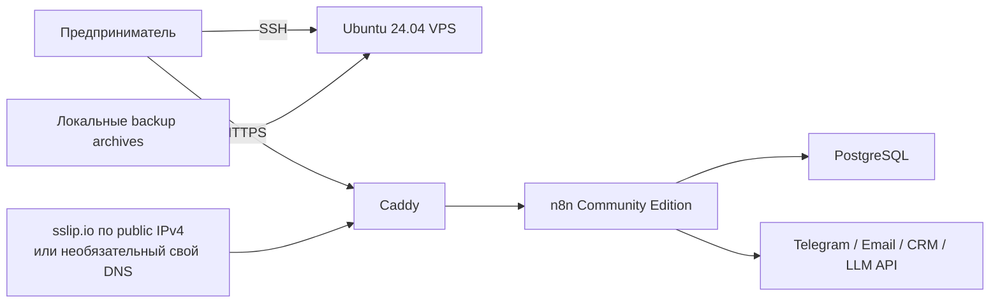
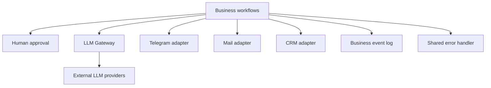

# Архитектура MVP

## Назначение

Документ фиксирует целевую архитектуру и границы MVP после research-gate `T-0002` и `T-0003`. Baseline проверен 2026-07-13; перед release и update изменчивые факты перепроверяются по [version research](research/2026-07-13-platform-versions-and-license.md) и [provider capability matrix](research/provider-capabilities.md).

## Контекст системы

## Базовый runtime

- Один VPS на Ubuntu 24.04 LTS x86_64.
- Docker Compose управляет тремя сервисами: Caddy, n8n и PostgreSQL.
- Caddy — единственная публичная HTTP(S)-точка и автоматически управляет TLS.
- n8n доступен Caddy по внутренней Docker network.
- PostgreSQL доступен только n8n по внутренней сети и не имеет host port binding.
- Данные n8n, PostgreSQL и Caddy хранятся в отдельных persistent volumes.
- Сервисы имеют health checks и restart policy для восстановления после reboot.
- Все images закреплены на явно проверенных версиях; `latest` запрещён.

Exact baseline:

| Компонент | Pin |
|---|---|
| n8n | `docker.n8n.io/n8nio/n8n:2.29.10` |
| PostgreSQL | `postgres:17.10-bookworm` |
| Caddy | `caddy:2.11.4-alpine` |
| Docker Engine для Ubuntu 24.04 amd64 | `5:29.6.1-1~ubuntu.24.04~noble` |
| Docker Compose plugin для Ubuntu 24.04 amd64 | `5.3.1-1~ubuntu.24.04~noble` |

Container digests записываются в release evidence после pull, но Compose использует exact application tags. Default registry остаётся official; Timeweb onboarding может явно выбрать allowlisted provider proxy без изменения tags. Политика версий зафиксирована в [ADR-0003](../adr/0003-version-pinning-policy.md), а bounded pull retry и proxy boundary — в [ADR-0012](../adr/0012-timeweb-dockerhub-proxy-fallback.md).

## Runtime configuration contract

Implementation в `T-0005` переносит следующие решения в `.env.example` и Compose без изменения смысла:

| Область | Обязательная конфигурация |
|---|---|
| Database | `DB_TYPE=postgresdb`, host `postgres`, port `5432`, отдельные database/user и сгенерированный password |
| Public URL | default `N8N_HOST=n8n-<public-ip>.sslip.io`; optional custom FQDN; `N8N_PROTOCOL=https`, editor/webhook URL используют тот же hostname |
| Reverse proxy | n8n слушает internal `5678`; `N8N_PROXY_HOPS=1`; наружу публикуются только Caddy `80/443` |
| Time | `TZ` и `GENERIC_TIMEZONE` равны пользовательской IANA timezone |
| Persistent identity | явно сгенерированный `N8N_ENCRYPTION_KEY`; persistent `/home/node/.n8n` и PostgreSQL data |
| n8n baseline | `N8N_ENFORCE_SETTINGS_FILE_PERMISSIONS=true`; internal task runners use n8n 2.x defaults (`N8N_RUNNERS_ENABLED` is deprecated) |
| Health | PostgreSQL `pg_isready`; n8n `/healthz`; external HTTPS/certificate/editor/webhook checks |
| Retention | `EXECUTIONS_DATA_PRUNE=true`, `EXECUTIONS_DATA_MAX_AGE=168`, `EXECUTIONS_DATA_PRUNE_MAX_COUNT=10000` |
| Execution evidence | success/error executions сохраняются в пределах retention; manual execution data доступна для учебной диагностики |
| Privacy | diagnostics и personalization disabled; workflow-node access к host environment остаётся blocked |

Все placeholders валидируются до старта. `.env.example` содержит только имена и безопасные defaults; реальный `.env` имеет `0600`, исключён из Git и backup-ится как secret material.

Реализация этого контракта: [`docker-compose.yml`](../docker-compose.yml), [`.env.example`](../.env.example), [`config/Caddyfile`](../config/Caddyfile) и [runtime configuration reference](runtime-configuration.md).

## Почему Caddy

Caddy выбран для базового профиля из-за небольшой конфигурационной поверхности и автоматического HTTPS. Выбор не отменяет обязательную проверку актуальной официальной документации, требований ACME, forwarded headers и pinned release в research-задаче.

## Установка

Публичный автономный `install.sh` — пользовательская точка входа. Он содержит versioned `git archive` и точный SHA-256, проверяет payload, разворачивает его в `/opt/n8n-entrepreneur-starter-kit` и вызывает внутренний `scripts/install.sh`. Артефакт собирается только из exact Git commit через `scripts/build-one-command-installer.sh`.

Внутренний `scripts/install.sh` должен:

1. проверить ОС, архитектуру, ресурсы, sudo, порты и исходящую сеть;
2. при отсутствии `N8N_HOST` определить публичный IPv4, построить `n8n-<IPv4>.sslip.io` и fail-closed проверить обратное разрешение;
3. установить или проверить системные зависимости и Docker из официально поддерживаемого источника;
4. прочитать необязательные overrides, сгенерировать secrets без вывода и записать `.env` с `0600`;
5. подготовить Compose stack без перезаписи существующих данных;
6. запустить сервисы и выполнить те же существенные проверки, что `doctor.sh`;
7. показать URL, пути и команды безопасной эксплуатации.

Image pull использует максимум три bounded attempts. Default source — official registries; только явный `N8N_IMAGE_SOURCE=timeweb` выбирает allowlisted Timeweb proxy с теми же exact tags и сохраняет выбор для последующих Compose-команд. Повторный запуск должен быть разумно идемпотентным. `--dry-run` не меняет систему. Изменение firewall выполняется только после отдельного подтверждения и не должно обрывать текущий SSH-доступ.

Реализация и таблица deterministic preflight/exit codes: [`scripts/install.sh`](../scripts/install.sh), [`scripts/build-one-command-installer.sh`](../scripts/build-one-command-installer.sh) и [installation reference](installation.md). Публичный URL является release gate: до выбора лицензии и размещения собранного артефакта по стабильному HTTPS-адресу документация показывает синтаксис, но не выдумывает работающий endpoint.

## Операционный контур

- `doctor.sh`: host, DNS, ports, containers, PostgreSQL, internal n8n, external HTTPS/certificate/webhook base URL.
- `backup.sh`: согласованный dump/config/volume data, версионированный archive и checksum.
- `restore.sh`: проверка checksum, совместимости и явное подтверждение до изменения данных.
- `update.sh` / `rollback.sh`: переход только на явно заданную версию с preflight, backup и health validation.
- `uninstall.sh`: останавливает и удаляет containers, но не удаляет данные автоматически.
- `import-workflows.sh` / `export-workflows.sh`: управляют workflow без credentials в JSON.

Первая destructive lifecycle pair — `n8n 2.29.9 → 2.29.10`. Rollback всегда восстанавливает согласованный pre-update backup вместе с возвратом pin; image-only downgrade запрещён. PostgreSQL major upgrade не входит в обычный update path и требует отдельного migration ADR и restore rehearsal.

## LLM abstraction

Бизнес-workflow не вызывают provider-specific API напрямую. Они обращаются к reusable `LLM Gateway` sub-workflow с нормализованным входом и структурированным выходом.

Утверждённые provider paths:

1. generic OpenAI-compatible endpoint использует native OpenAI Chat Model только после Connection Test; Responses API и tools выключены, JSON проверяется локально по ограниченной schema;
2. при несовместимом или отсутствующем `/models` используется manual model ID, а при блокирующем credential test — HTTP Request adapter;
3. Yandex AI Studio — provider-specific HTTP Request adapter к `https://ai.api.cloud.yandex.net/v1`: API key только в n8n credential, folder через `OpenAI-Project`, полный `gpt://<folder>/<model>/<version>` URI, обязательный `/models` connection diagnostic и локальная JSON Schema validation; native/provider schema modes требуют отдельного authenticated evidence;
4. GigaChat — provider-specific HTTP Request adapter с execution-local token, ранним refresh по `expires_at` и максимум одним refresh/retry после `401`; long-lived authorization key хранится только в n8n credential, а host CA bundle подключается read-only без отключения TLS verification;
5. другие endpoints добавляются только после capability matrix и contract tests.

Нормализованные inputs, outputs, errors, provider flags и secret rules заданы в [LLM Gateway contract](contracts/llm-gateway.md). Credentials создаются в n8n и никогда не встраиваются в workflow JSON. LiteLLM исключён из MVP: измеренного gap в routing, failover или compatibility нет; добавление proxy требует измеримого evidence и нового ADR для service, secret boundary и operations surface.

## Workflow layers

Core sub-workflows: LLM Gateway, Send Telegram Message, Request Human Approval, Normalize Incoming Message, Provider-Neutral Mail Gateway, CRM Create or Update Lead, CRM Create Task, Log Business Event и Handle Workflow Error.

Mail Gateway разделяет три операции одним строгим контрактом: IMAP adapter нормализует provider output в bounded untrusted plain text; бизнес-workflow создаёт draft; SMTP-ветка открывается только точным unexpired approval result T-0017 с тем же `idempotencyKey`, при `testMode=false`, `draftOnly=false` и без attachments. Canonical processing marker, threading IDs и durable state дают adapter данные для deduplication/reply-loop protection; credentials остаются в n8n credential store. Pinned Send Email node не поддерживает custom threading headers, поэтому это ограничение явно fail-visible в [mail contract](contracts/mail.md); настройка описана в [IMAP/SMTP guide](credentials/mail.md).

Business workflows: Telegram assistant, email assistant, lead handler и daily executive digest. Любое внешнее сообщение или изменение CRM требует human approval по умолчанию; Telegram assistant работает в `draft-only` по умолчанию.

Lead handler реализован как Header Auth webhook с отдельными intake/resolve фазами: `eventId` останавливает replay до LLM, nullable extraction не может разрешить mutation, а точный owner-bound approval открывает последовательность lead upsert → task create → Telegram notice. Provider-neutral mapping, partial-failure reconciliation и setup зафиксированы в [руководстве Lead Handler](workflows/lead-handler.md).

Daily executive digest использует детерминированное окно `[предыдущие 09:00, текущие 09:00)` в `Europe/Moscow` и агрегирует только каноническую схему `Log Business Event`. Встроенный schedule является единственным production-планировщиком и синхронно вызывает настраиваемый source-adapter sub-workflow с точными границами окна; direct trigger предназначен для test/manual batch. Полные метрики допустимы лишь при явном source coverage всего окна; partial source показывает наблюдаемые числа с предупреждением, missing source — `null`/`н/д`, но никогда не молчаливые нули. LLM получает только окно, статус покрытия и агрегаты, а точные числа в Telegram формируются детерминированно. Core logger сейчас является schema/normalization boundary, а не durable query store; production source adapter или event store требует отдельной проверки. Контракт и setup описаны в [руководстве Daily Executive Digest](workflows/daily-executive-digest.md).

## Trust boundaries и secrets

- Internet → Caddy: разрешены только необходимые публичные порты 80/443.
- Caddy → n8n и n8n → PostgreSQL: приватные Compose networks.
- n8n → внешние API: исходящие TLS-запросы с credentials из n8n credential store.
- SSH → host: firewall changes не применяются без подтверждения и проверки SSH rule.
- Git → runtime: `.env`, credentials, backup archives и реальные fixtures исключаются.
- Docker socket не монтируется в n8n; privileged mode и лишние capabilities запрещены.
- Постоянный `N8N_ENCRYPTION_KEY` и права `.env` `0600` обязательны.
- Provider API keys, OAuth client secrets, refresh/access tokens и Bitrix24 webhook URL никогда не хранятся в workflow JSON, fixtures или business logs.
- Canonical Bitrix24 adapter использует OAuth 2.0 credential с Bearer header. Incoming webhook допускается только как локальный ручной smoke test и не входит в экспортируемый workflow, пока нет проверенного encrypted credential path для URL secret.
- GigaChat authorization key хранится в credential; временный access token живёт только внутри execution и маскируется в errors/logs.
- Yandex API key хранится только в HTTP Header Auth credential; folder/model identifiers проверяются до provider call, а raw auth/model error bodies наружу не передаются.
- Execution data может содержать ПДн. Default: pruning включён, max age `168` часов, max count `10000`; успешные и ошибочные executions сохраняются в пределах этих лимитов для учебной диагностики. Guide обязан объяснить уменьшение retention.
- Diagnostics/personalization выключены в default profile; доступ к environment из workflow nodes не открывается ради обхода credential store.
- TLS certificate verification не отключается. Необходимые доверенные root certificates устанавливаются и проверяются явно.

## Quality strategy

Пирамида проверок:

1. static: shellcheck, formatting, syntax, JSON validation и secret scan;
2. configuration: `docker compose config`, pinned images и security assertions;
3. integration: workflow import, n8n↔PostgreSQL, internal health, scripts idempotency;
4. destructive lifecycle: backup/delete/restore и update/rollback;
5. external smoke: DNS, HTTPS certificate, webhook, LLM и Telegram с user-provided credentials;
6. reboot persistence на реальной или disposable Ubuntu среде;
7. novice usability trial на 15–30 минут.

Непроверенные шаги маркируются как требующие VPS/credentials. Симуляция не считается успехом.

## Архитектурные ограничения

- Базовый профиль остаётся односерверным и понятным новичку.
- Расширение платформы, queue mode или proxy layer требует отдельного ADR и измерения влияния на RAM, установку и сопровождение.

## Явно неподдерживаемые сценарии MVP

- другие host OS/architecture, кроме Ubuntu 24.04 LTS x86_64;
- path-prefix deployment, несколько n8n instances, queue mode, HA, Kubernetes и horizontal scaling;
- Redis, vector database, local LLM и обязательный LiteLLM proxy;
- публичные host ports n8n/PostgreSQL, Docker socket mount, privileged containers и отключённая TLS verification;
- unattended major/minor updates, плавающие tags и image-only database rollback;
- гарантии tool calling, Responses API или provider-native JSON Schema без отдельного contract test;
- экспорт workflow с credentials, tokens, webhook secrets или реальными персональными fixtures;
- managed/multi-tenant/white-label n8n hosting без нового license review и, при необходимости, коммерческого соглашения;
- автоматическое изменение firewall без отдельного подтверждения и защиты активного SSH-доступа.

## Implementation-ready decisions

Для runtime task `T-0005` закрыты критические выборы: service topology, exact tags, public/private ports, volumes, URL/proxy variables, health endpoints, retention defaults, update/rollback rule, provider paths и secret boundaries. Реальные pull, Compose validation, TLS, provider credentials и destructive lifecycle остаются проверками реализации, а не открытыми архитектурными решениями.
